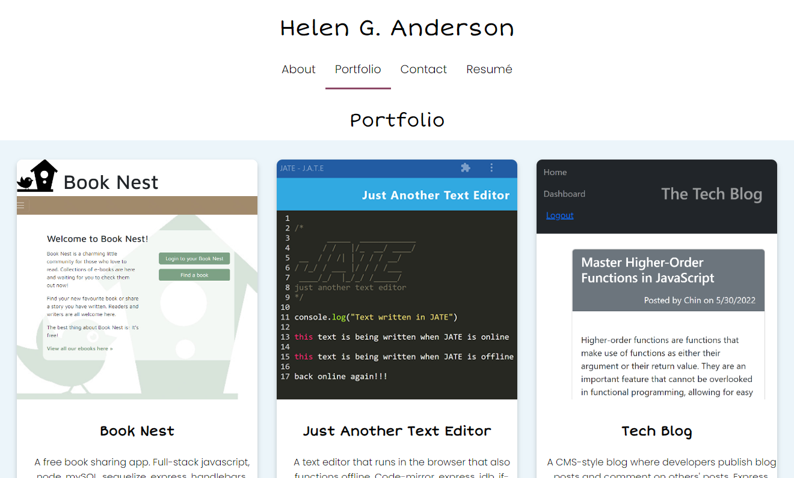
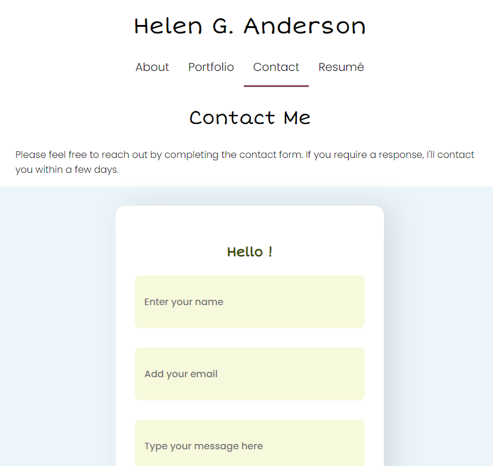
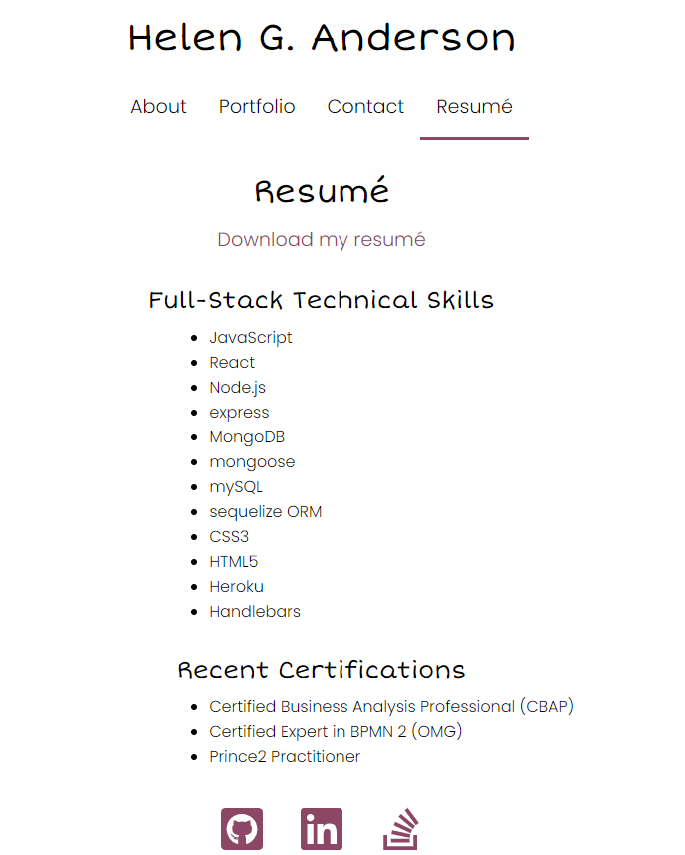

# React Portfolio

## Description

The **React Portfolio** is a developer portfolio single-page application built using React. The app shares projects and a resume for applying for jobs. It also can be used to share work with the developer community and collaborate on projects. [Create-react-app](https://github.com/facebook/create-react-app) was used to kick start app development. [React Router](https://www.npmjs.com/package/react-router-dom) was used to create the routing, and [React Icons](https://www.npmjs.com/package/react-icons) to display icons that link to developer profiles on GitHub, LinkedIn and Stack Overflow.

The app is deployed to [GitHub's GH Pages](https://grace-anderson.github.io/react-portfolio/), with the code available on [GitHub](https://github.com/grace-anderson/react-portfolio)

## Table of Contents

- [React Portfolio](#react-portfolio)
  - [Description](#description)
  - [Table of Contents](#table-of-contents)
  - [Technologies](#technologies)
  - [Usage](#usage)
  - [Functionality](#functionality)
  - [Installation](#installation)
  - [Contribution Guidelines](#contribution-guidelines)
  - [Screenshots of deployed React Portfolio app](#screenshots-of-deployed-react-portfolio-app)
  - [License](#license)

## Technologies

This application uses the following technologies:

**Dependencies**
* [react](https://www.npmjs.com/package/react)
* [react-dom](https://www.npmjs.com/package/react-dom)
* [react-icons](https://www.npmjs.com/package/react-icons)
* [react-router-dom](https://www.npmjs.com/package/react-router-dom)
* [react-scripts](https://www.npmjs.com/package/react-scripts)
* [web-vitals](https://www.npmjs.com/package/web-vitals)

**Dev dependencies**
* [@testing-library/jest-dom](https://www.npmjs.com/package/@testing-library/jest-dom)
* [@testing-library/react](https://www.npmjs.com/package/@testing-library/react)
* [@testing-library/user-event](https://www.npmjs.com/package/@testing-library/user-event)
* [eslint](https://www.npmjs.com/package/eslint)

**Deployment**
* [gh-pages](https://www.npmjs.com/package/gh-pages)

## Usage

* Access the live **React Portfolio** via its [GH Pages url](https://grace-anderson.github.io/react-portfolio/)

## Functionality

**React Portfolio** provides the following functionality.
* A single-page app, with a resume and a portfolio of projects that changes views without reloading the page.
* The portfolio links through to the developer profiles on GitHub, LinkedIn and Stack Overflow.
* The developer's resume can be downloaded from the Resume page
* The portfolio contains six recent projects, with links to deployed apps or demonstration videos and also links to the code on [GitHub](https://github.com/grace-anderson/react-portfolio)
* You can choose to install the app locally (see [Installation](#installation))  

## Installation
To install and run the **React Portfolio** application code locally,
* Download or clone the code from the [GitHub repository](https://github.com/grace-anderson/react-portfolio)
  * run ``npm run install`` in the root directory of the project to install  dependencies
  * run ``npm run build`` in the root directory of the project to build the application
  * run ``npm test`` to launch the test runner in the interactive watch mode
  * run ``npm run start`` from the root directory to start the server
  * navigate to your browser, and open the app locally at url ``localhost:3000``
* If you wish to deploy, here are [instructions for deploying via GH Pages](https://create-react-app.dev/docs/deployment/#github-pages)

## Contribution Guidelines

* Contributions are welcome.
* The code is located in this [GitHub](https://github.com/grace-anderson/react-portfolio) repo
* To contribute, open a new issue describing your proposed enhancement or fix.
  * Before contributing, browse through open issues to see if your issue already exists or if there is an issue or enhancement you could to solve. 
  * If you're a newbie dev, start contributing by looking for issues labelled "good first issue"
* It is good practice to set up your project repository as an "upstream" remote and synchronize with the project repository
  * Don't update the main branch. Rather create your own branch using a brief descriptive name and make your changes there
* You can create pull requests, but only admins can review and merge.
  * Be nice to your reviewer by adding adding a plain English explanation of your pull request and how your updates addresses the issue/s or enhancements  
* Also see the [GitHub Community Guidelines](https://docs.github.com/en/site-policy/github-terms/github-community-guidelines)

## Screenshots of deployed React Portfolio app

1. Home and About page
   
   

2. Portfolio page
   
   

3. Contact page

4. Resume page

## License

© 2022 [Helen Anderson](https://github.com/grace-anderson) 

This project is licensed under the [MIT License](https://opensource.org/licenses/MIT).

